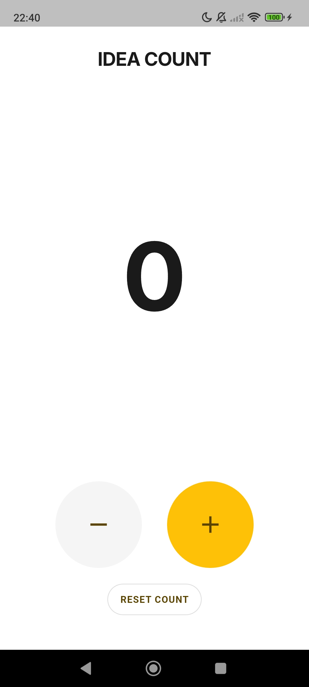
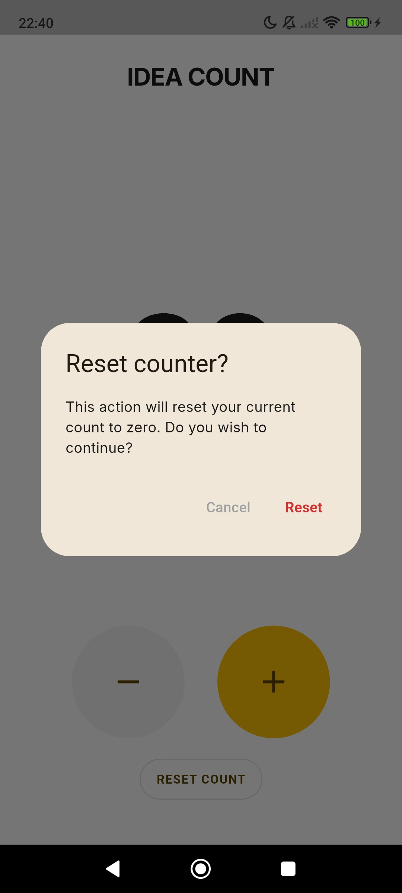

# Idea Count - Simple Counter

## Product Definition

- **Name**: Idea Count
- **Goal**: A simple, fast, and minimalist digital counter to increase or decrease a value with a single tap.
- **Problem it solves**: Enables quick counting without distractions, replacing improvised methods such as mental counting, tallying on paper, or apps cluttered with unnecessary features.
- **Audience**: Users who need to count things quickly: workout repetitions, items, scores, tasks, or any simple day-to-day counting.
- **Platforms**: Android.
- **Features**:
    - Display a centered number on screen.
    - Initial value: **0**.
    - **+** button to increment.
    - **-** button to decrement.
    - Instant value update.
    - Number pulse / scale effect (Scale Animation).
    - Haptic feedback (vibration on tap).
    - Audio feedback on tap (low-latency pre-buffered sounds).
    - Persist last value across app restarts (`shared_preferences`).
    - Reset button.
    - Jump animation on reset (Reset Jump).
    - Confirmation dialog on reset.
    - Minimalist interface.
- **Potential future features**:
    - Dark mode.
    - Count history.
    - Multiple counters.
    - Custom themes.
    - Data backup.
    - Advanced animations and visual effects.
    - Login and cross-device sync.
    - Ads.

## Design

**Description**: Simple counter with a large dark number in the center of the screen. Below the number are two buttons, "-" and "+", to increase or decrease the number, which initially starts at 0. The buttons are large and round, with decrement in gray and increment in yellow.

  


Idea Count follows the Idea36 Labs visual identity:

- Minimalist interface.
- White background.
- Inter typography.
- Large centered number.
- Idea36 Yellow (#FFC107) as the primary action color.
- High contrast and few elements.

#### Principles:

- Simplicity;
- Quick usage;
- Focus on the counter;
- One-handed experience.

## Architecture

### Folder structure

```
lib/
├── main.dart
├── pages/
│   └── counter_page.dart
├── services/
│   ├── counter_storage_service.dart
│   └── sound_service.dart
├── theme/
│   └── app_theme.dart
└── widgets/
    ├── counter_button.dart
    ├── counter_display.dart
    └── reset_confirmation_dialog.dart
```

### Responsibilities

#### main.dart

Application entry point.

- Initializes Flutter bindings (`WidgetsFlutterBinding.ensureInitialized()`).
- Eagerly initializes and pre-warms `SoundService` before `runApp()` for instant first-tap audio response.
- Locks device orientation exclusively to portrait mode.
- Injects dependencies into the root `IdeaCountApp` widget.
- Configures global theme and sets `CounterPage` as the home screen.

#### pages/

Contains full application screens.

- **`counter_page.dart`**: Main screen that orchestrates the UI, coordinates state changes, invokes services (sound and persistence), and renders widget components.

#### services/

Encapsulates non-UI logic, external plugins, and data infrastructure:

- **`counter_storage_service.dart`**: Persistence layer managing asynchronous save and load operations for the counter value via `shared_preferences`.
- **`sound_service.dart`**: Audio feedback layer managing pre-buffered pools (`AudioPool`) with `PlayerMode.lowLatency` (Android SoundPool) for near-instant playback on rapid taps.

#### widgets/

Reusable and modular UI components:

- **`counter_button.dart`**: Circular, customizable tactile buttons for increment and decrement actions with visual and haptic feedback.
- **`counter_display.dart`**: Displays the counter value with smooth scale animations and a jump animation upon reset.
- **`reset_confirmation_dialog.dart`**: Modal confirmation dialog preventing accidental counter resets.

#### theme/

Centralizes visual design tokens:

- Colors;
- Typography (`Inter` font family);
- Button and dialog styles;
- Material 3 theme definition.

Avoids hardcoded colors and styles scattered throughout the code.

### State management & Architecture Patterns

- UI state is managed directly using Flutter's built-in `StatefulWidget` and `setState()`, keeping the codebase simple and lightweight.
- Clear separation of concerns: storage and audio playback are extracted into standalone service classes under `services/`, keeping the UI layer decoupled from device and storage APIs.
- Dependencies are passed down via constructor injection (`main` → `IdeaCountApp` → `CounterPage`).

## Changelog

### v1.1.0
- **Audio Feedback:** Integrated instant auditory feedback on tap using `AudioPool` with `lowLatency` mode (Android SoundPool) and eager startup initialization.
- **Visual Identity:** Updated app launcher icon and refreshed native asset bundles.
- **Architectural Refactoring:**
  - Applied Clean Architecture principles by isolating persistence into `CounterStorageService`.
  - Extracted UI components into modular widgets (`CounterDisplay`, `CounterButton`, `ResetConfirmationDialog`).
  - Implemented constructor dependency injection from `main()`.
- **Performance & UI Fixes:** Prevented animation queue buildup on rapid taps and decoupled storage execution from `setState`.
- **Localization:** Translated in-app UI messaging, code comments, and documentation to English.

### v1.0.0
- Initial public release on Google Play Store.
- Core minimalist counter functionality with tap-to-count (+/-).
- Micro-interactions (haptic feedback, pulse effect, and reset jump animation).
- Persistent state using `shared_preferences`.

## Privacy Policy

Privacy policy link for the **Idea Count** app: 

🔗 [idea36labs.com/ideacount/privacy](http://www.idea36labs.com/ideacount/privacy.html)